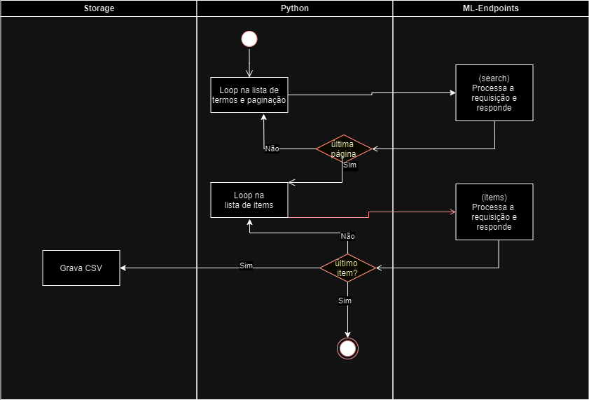
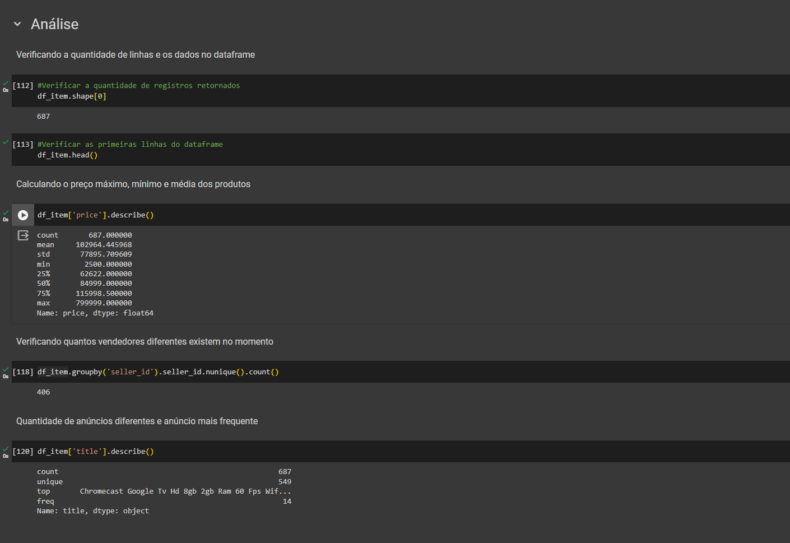

# ml-challenge-python

Repositório criado para o desafio de python do mercado livre. O código abaixo foi executado no google Colab. O notebook pode ser encontrado no arquivo [ml_challenge_API.ipynb](ml_challenge_API.ipynb)

## 1) Percorrer uma lista de mais de 150 IDs de itens no serviço público:

O resultado foi alcançado utilizando a lib requests do python. O código abaixo contém um loop que irá acessar a API várias vezes e buscar os produtos da lista 'termos' buscando 50 itens por vez até ter lido todos os itens

```python 
import requests

termos = ['chromecast','Apple%20TV', 'Amazon%20Fire%20TV']
# cria o lista vazia para o resultado da busca
produtos = []
for x in termos:
  # controle da paginação da API
  offset=0 
  while True:
    # Monta a URL da API
    urlbusca = 'https://api.mercadolibre.com/sites/MLA/search?q='+x+'&limit=50&offset=' + str(offset)
    print(urlbusca)
    
    # Envia o Request para o Endpoint
    response = requests.get(urlbusca)

    if response.status_code == 200:
        # Obtem o json da resposta da API
        data = response.json()
        #print(data)
        
        # Colocar o json do resultado em um dataframe do pandas
        produtos.extend(data["results"])
    else:
        # Caso retornou erro printa a mensagem 
        print('Error: {}'.format(response.status_code))

    # Verifica se é a última página se sim sai do loop 
    if data['paging']['total'] <= offset + 50:
        break 
    else:
        offset += 50

```

## 2) Para cada resultado, realize o GET by Item_Id correspondente ao recurso público: https://api.mercadolibre.com/items/{Item_Id} 

Utilizando a lista de itens criada na etapa anterior, o código abaixo itera sobre a lista e para cada item da lista irá acessar a api de itens e concatenar o resultado em uma lista. Após concluir a construção da lista converte a lista de dicionários em um dataframe do pandas e exporta o dataframe em CSV


```python
#iterar no dataframe da busca linha a linha 
items = []
for item in produtos:
  # Monta a URL de busca do item
  urlitem = 'https://api.mercadolibre.com/items/'+ item['id'] 
  #print(urlitem)
 
  # Envia o Request para o Endpoint
  response = requests.get(urlitem)
  #print(response.json())
  if response.status_code == 200:
    items.append(response.json())
    
  else:
    # Caso retornou erro printa a mensagem 
    print('Error: {}'.format(response.status_code))
df_item = pd.DataFrame(items)
df_item.to_csv('items.csv')
```


 ## 3) Escrever os resultados:

 Foi realizado na etapa anterior com a linha:

```python
df_item.to_csv('items.csv')
```

## 3) Preparar o desenho e documentação da solução

O diagrama abaixo representa o fluxo do algoritmo desenvolvido para a solução




## 5) Análise Exploratória

Algumas análises exploratórias básicas realizadas no notebook



